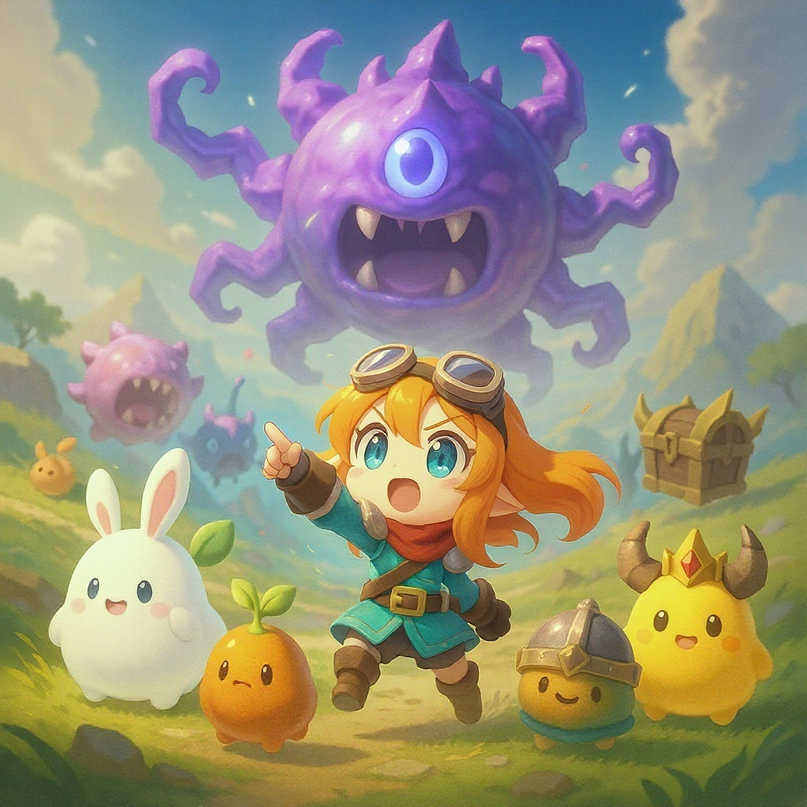
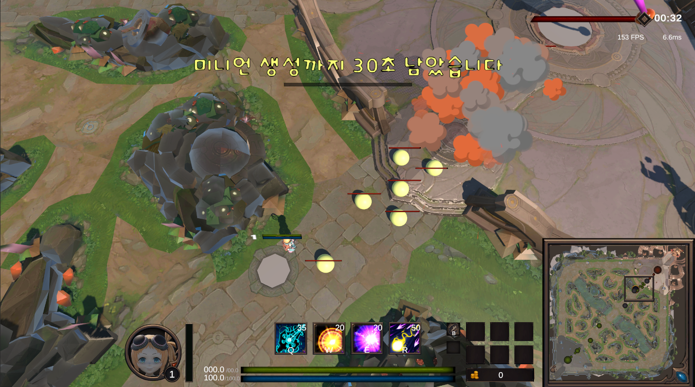

**ProjectA (MOBA 스타일 게임)**
---

● OS : Window<br>
● Unity Version : 2022.3.60f1<br>
● 작업기간 8월 9일 ~ (진행중)<br>
● 평일 : 약 2-3시간<br>
● 주말 : 약 8-10시간<br>

목차
---
1. 게임 소개

2. 조작 방법

3. 주요 기능 / 시스템

4. 스크린샷 / 영상

5. 설치 및 실행

6. 디렉토리 구조

7. 주의 사항

8. 기여 방법

9. 참고 링크


1️⃣ 게임 소개
---
● ProjectA는 전략 전투를 즐기는 MOBA 게임입니다.<br>
● 플레이어는 기본 공격과 스킬을 사용하며, 미니언을 처치하여 골드를 획득하고 아이템을 구매할 수 있습니다.<br>
● 포탑을 부수고 넥서스를 파괴하여 승리를 쟁취하세요.<br>

2️⃣ 조작 방법
---
● 마우스 ( 땅 ) 클릭 : 캐릭터 이동

● 마우스 ( 몬스터 / 포탑 / 넥서스 클릭 ) : 캐릭터 공격

● 스킬 : ( Q, W, E, R )

3️⃣ 주요 기능 / 시스템
---
**맵 & 게임 모드**

● 미니언 생성 : 1분 (60초)

● 아군: 넥서스 1, 터렛 3, 미니언 웨이브 6

● 적군: 넥서스 1, 터렛 3, 미니언 웨이브 6

**UI / HUD**

● 프로필, 스킬, 미니맵, 프레임(ms), 귀환, 인벤토리, 상점

4️⃣ 스크린샷 / 영상
---




5️⃣ 설치 및 실행
---
● GitHub에서 프로젝트 클론 또는 ZIP 다운로드:

git clone https://github.com/Kimhyogyeom/ProjectA.git


● Firebase 로그인 기능 사용 시, Firebase Unity SDK 설치 필요:
https://firebase.google.com/docs/unity/setup?utm_source=chatgpt.com&hl=ko

● Unity에서 Assets/Scenes/MainScene.unity 열고 Play or Login Scene 확인

6️⃣ 디렉토리 구조
---
```
Assets/
├─ Animations/
├─ Editor Default Resources/
├─ ExternalDependencyManager/
├─ Firebase/
├─ Font/
├─ Images/
├─ Materials/
├─ Models/
├─ Particles/
├─ Plugins/
├─ Prefabs/
├─ Resources/
├─ Scenes/
├─ Scripts/
|   +---Camera
|   |   +---Move
|   |   |       CameraMovement.cs
|   |   \---Zoom
|   |           CameraZoomController.cs
|   +---Canvas
|   |       BullboardCanvas.cs
|   +---EndGame
|   |       TextTweenEffect.cs
|   +---Enumy
|   |   +---Manager
|   |   |       EnemyManager.cs
|   |   +---Move
|   |   |       EnemyMovement.cs
|   |   +---Stat
|   |   |       EnemyStats.cs
|   |   \---UI
|   |           EnumyHpBar.cs
|   +---Firebase
|   |       FirebaseAuthController.cs
|   +---Golem
|   |   +---Attack
|   |   |       GolemAttack.cs
|   |   +---Move
|   |   |       GolemAI.cs
|   |   +---Stat
|   |   |       GolemStats.cs
|   |   \---UI
|   |           GolemHpBar.cs
|   +---Inventory
|   |       InventoryItemDown.cs
|   |       InventoryItemDrag.cs
|   +---Item
|   |       ItemInfomation.cs
|   +---Manager
|   |   +---Fps
|   |   |       MsDisplay.cs
|   |   +---Ms
|   |   |       FpsDisplay.cs
|   |   \---Time
|   |           ElapsedTimeDisplay.cs
|   |   GameManager.cs
|   |   Manager.cs
|   +---MInimap
|   |       MinimapController.cs
|   |       MiniMapDragCamera.cs
|   +---Mouse
|   |   \---Click
|   |           ClickEventDisable.cs
|   +---Nexus
|   |   \---UI
|   |           NexusHpBar.cs
|   |   EnemySpawn.cs
|   |   NexusController.cs
|   |   NexusStats.cs
|   +---NPC
|   |       NpcStoreClickEvent.cs
|   +---Player
|   |   +---Attack
|   |   |       PlayerAttack.cs
|   |   |       PlayerTargetObject.cs
|   |   +---Die
|   |   |       PlayerDieController.cs
|   |   +---Move
|   |   |       PlayerMovement.cs
|   |   +---Skill
|   |   |       PlayerSkillController.cs
|   |   |       PlayerSkillQ.cs
|   |   |       PlayerSkillR.cs
|   |   |       PlayerSkillW.cs
|   |   +---Stat
|   |   |       PlayerStatPoint.cs
|   |   |       PlayerStats.cs
|   |   |       PlayerStatUpdate.cs
|   |   +---Teleport
|   |   |       PlayerTeleport.cs
|   |   \---UI
|   |           PlayerExpBar.cs
|   |           PlayerHpBar.cs
|   |           PlayerMpBar.cs
|   +---Sound
|   |       SoundManager.cs
|   +---Store
|   |       StoreController.cs
|   |       StoreDragHandler.cs
|   +---System
|   |       MessageController.cs
|   |       SystemMessage.cs
|   +---Text
|   |       GetGoldText.cs
|   +---Turret
|   |   +---UI
|   |   |       TurretHpBar.cs
|   |   TurretAttack.cs
|   |   TurretAttackObject.cs
|   |   TurretDestory.cs
|   |   TurretStats.cs
|   \---UI
|           SkillDiscription.cs
├─ Settings/
├─ StreamingAssets/
└─ TextMesh Pro/
Packages/
ProjectSettings/
.gitignore
```

**● Firebase SDK 관련 파일은 Git LFS로 제외되어 있습니다.**


7️⃣ 주의 사항
---
● Library/, Temp/, Obj/, Build/ 등 자동 생성 파일 제외

● PC 환경 테스트 권장

● Firebase SDK 설치 필요 (로그인/계정 기능)

● 빌드 전 Unity 버전 확인 필수


8️⃣ 기여 방법
---
● 기능 추가, 버그 수정, UI 개선 PR 가능

● Firebase 관련 SDK 파일 포함 금지

● 코드 스타일: C# 스크립트 네이밍 규칙 준수


9️⃣ 참고 링크
---
● Unity 공식 사이트 (https://unity.com/kr?utm_source=chatgpt.com
)

● Firebase Unity SDK (https://firebase.google.com/docs/unity/setup?utm_source=chatgpt.com
)

● Git LFS 안내 (https://git-lfs.com/?utm_source=chatgpt.com
)

---